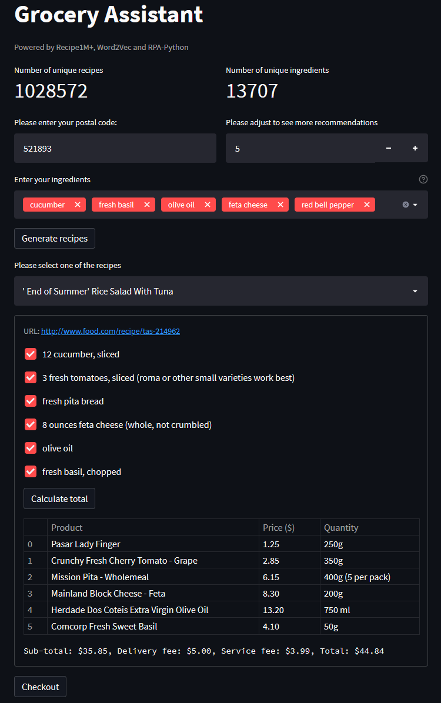

# GroceryAssistant

The goal of this project is to build a simple Intelligent Process Automation(IPA) robot that does the following:
1. Provides recipe recommendations based on user inputs
2. Automates the buying process on online grocer platforms like FairPrice and Redmart. (based on Singapore context)

This demo uses Streamlit API for rapid website deployment, Recipe1M+ dataset to build the ingredient corpus, Gensim's Word2Vec implementation for training the ingredient embeddings and lastly, RPA-Python by AI Singapore to build the IPA robot.



### Embedding projection
Files in `viz` folder can be used to visualize the embedding vector space using [Tensorflow's Embedding Projector](https://projector.tensorflow.org/).

## User Guide (Windows only)
You will require to have Anaconda installed in your system.

### Folder structure
```
GroceryAssistant
│
├──data
│   │  clean_recipes.json
│   │  corpus.json
│   │  doc_vectors.npy
│   │  recipes.json
│   └─ word2vec.kv
│
├──src
│   │  app.py
│   │  buyer_core.py
│   └─ embedder_core.py
│
├──viz
│   │  metadata.tsv
│   └─ vectors.tsv
```
### 1. Create main directory
From Windows Terminal
> mkdir {your-path}/GroceryAssistant \
> cd {your-path}/GroceryAssistant
### 2. Download repo files
> git clone https://github.com/syalabi-seet/GroceryAssistant.git
### 3. Download data files from [link](https://drive.google.com/file/d/1K2opCI32NBybaEwi-EjiY58gEwfmcx8h/view?usp=sharing)
### 4. Extract files into `data/` folder
### 5. Create new conda environment
From Anaconda Prompt
> conda create --name GroceryAssistant python==3.8.13 -y \
> conda activate GroceryAssistant \
> pip install -r requirements.txt
### Run app.py
> streamlit run src/app.py
## References
1. [Recipe1M+ dataset](http://pic2recipe.csail.mit.edu/)
2. [Efficient Estimation of Word Representations in Vector Space](https://arxiv.org/abs/1301.3781)